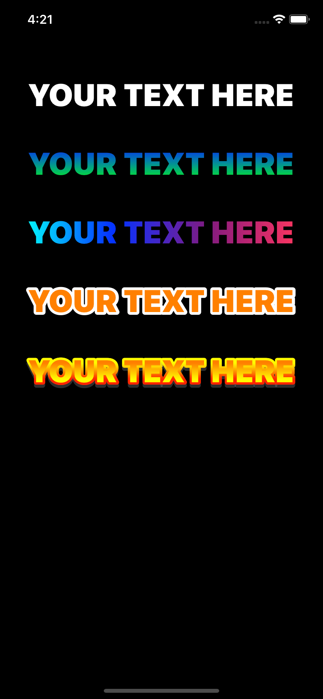

# OutlinedLabel
UILabel subclass that lets you add gradient and outline text




## Gradient text
In this example we can see how to add the gradient to the text.


```swift
label.textGradientColors = [.blue, .green]
```


## Custom gradient text
In this example we can see how to customize the text gradient.


```swift
label.textGradientColors = [.cyan, .blue, .purple, .systemPink]
label.textGradientStartPoint = CGPoint(x: 0, y: 0.5)
label.textGradientEndPoint = CGPoint(x: 1, y: 0.5)
```


## Outlined text
In this example we can see how to add a white outline.


```swift
label.outlineColor = .white
label.outlineWidth = 7
```


## Outlined gradient text
In this more complete example, we can see how to add the gradient to the text, the outline and a shadow.


```swift
label.outlineWidth = 6
label.outlineGradientLocations = [0.3, 0.7]
label.outlineGradientColors = [.yellow, .red]

label.textGradientColors = [.orange, .yellow]
label.textGradientLocations = [0.3, 0.7]
label.shadowColor = UIColor.gray.withAlphaComponent(0.2)
label.shadowOffset = CGSize(width: 0, height: 4)
```


**© Adriano Cosme Rezena | 2021**
